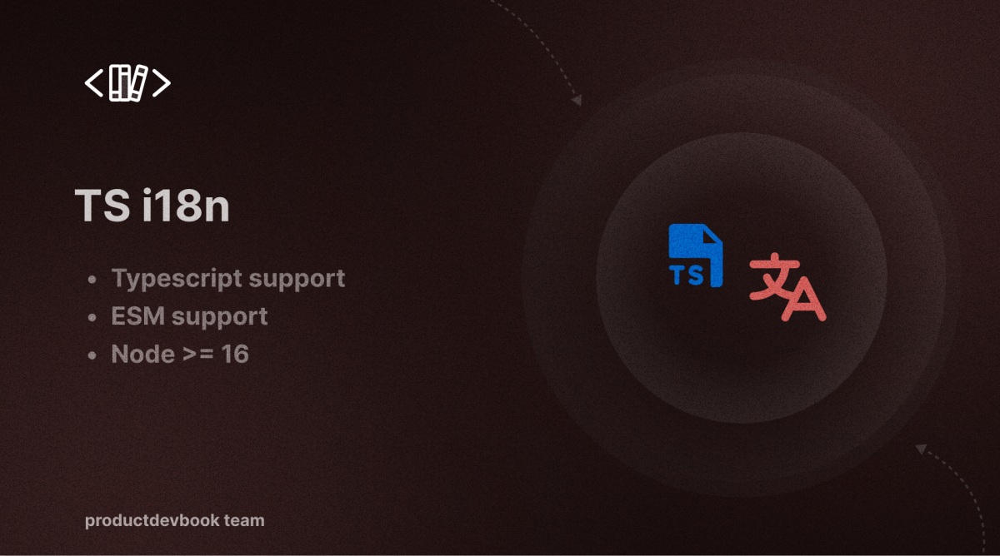
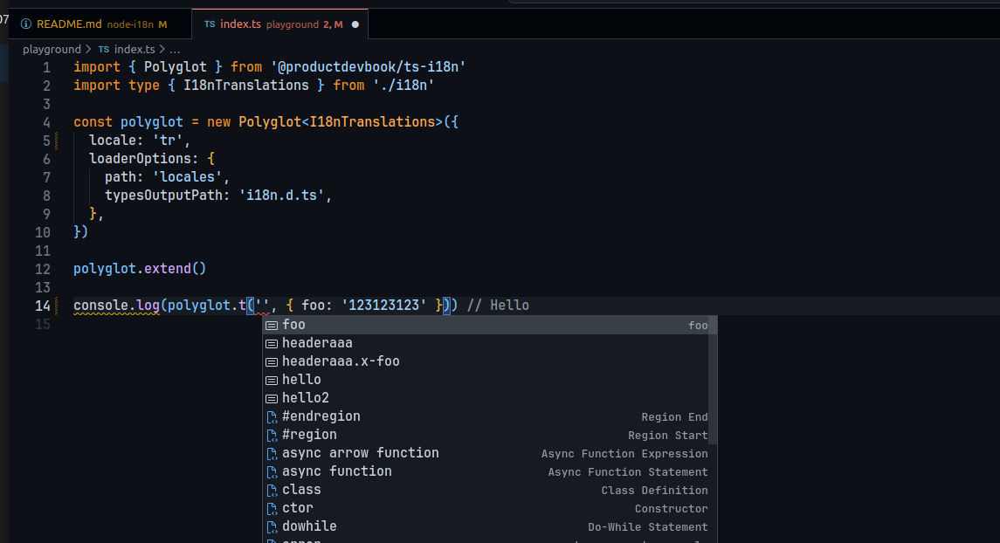

# TS I18n




<p>
      <a href="https://www.npmjs.com/package/@productdevbook/ts-i18n"></a>
      <a href="https://www.npmjs.com/package/@productdevbook/ts-i18n"></a>
      <a href="./LICENSE"></a>
      <a href="https://github.com/productdevbookcom/ts-i18n">
       </a>
      <a href="https://chat.productdevbook.com"> </a>
</p>

"ts-i18n" is a Typescript library that facilitates internationalization (i18n) in both browser and ES module environments (Node). It offers a lightweight solution for interpolation and pluralization. 

Unlike some i18n libraries, ts-i18n doesn't handle the actual translation of phrases. Instead, it provides tools for managing translated phrases within your client or server-side Typescript application, making it agnostic to the translation backend used."

## Features

- Typescript support
- Node.js Version >= 16.0.0
- No dependencies
- ES module support

## Installation

```bash
pnpm add @productdevbook/ts-i18n
```

## Usage

### Translation
Tell Polyglot what to say by simply giving it a phrases object, where the key is the canonical name of the phrase and the value is the already-translated string.

```ts
import { Polyglot } from '@productdevbook/ts-i18n'

const polyglot = new Polyglot({
  locale: 'en',
})

polyglot.extend({
  hello: 'Hello'
})

polyglot.t('hello') // Hello
```
You can also pass a mapping at instantiation, using the key phrases:

```ts
const polyglot = new Polyglot({ phrases: { hello: 'Hello' } })
```

Polyglot doesn’t do the translation for you. It’s up to you to give it the proper phrases for the user’s locale.

### Interpolation
`Polyglot.t()` also provides interpolation. Pass an object with key-value pairs of interpolation arguments as the second parameter.

```ts
import { Polyglot } from '@productdevbook/ts-i18n'

const polyglot = new Polyglot({
  locale: 'en',
  phrases: {
    hello_name: 'Hello %{name}',
  },
})

polyglot.extend({
  hello_name: 'Hola, %{name}.'
})

polyglot.t('hello_name', { name: 'DeNiro' }) // Hola, DeNiro.
```

Polyglot also supports nested phrase objects.

```ts
polyglot.extend({
  nav: {
    hello: 'Hello',
    hello_name: 'Hello, %{name}',
    sidebar: {
      welcome: 'Welcome'
    }
  }
})

polyglot.t('nav.sidebar.welcome') // Welcome
```

The substitution variable syntax is customizable.

```ts
const polyglot = new Polyglot({
  locale: 'en',
  phrases: {
    hello_name: 'Hola {{name}}'
  },
  interpolation: { prefix: '{{', suffix: '}}' }
})

polyglot.t('hello_name', { name: 'DeNiro' }) // Hola DeNiro
```

### Pluralization

For pluralization to work properly, you need to tell Polyglot what the current locale is. You can use `polyglot.locale("tr")` to set the locale to, for example, Turkish. This method is also a getter:

```ts
polyglot.locale() // tr
```
You can also pass this in during instantiation.

```ts
const polyglot = new Polyglot({ locale: 'tr' })
```

Currently, the only thing that Polyglot uses this locale setting for is pluralization.

Polyglot provides a very basic pattern for providing pluralization based on a single string that contains all plural forms for a given phrase. Because various languages have different nominal forms for zero, one, and multiple, and because the noun can be before or after the count, we have to be overly explicit about the possible phrases.

To get a pluralized phrase, still use `polyglot.t()` but use a specially-formatted phrase string that separates the plural forms by the delimiter `||||`, or four vertical pipe characters.

For pluralizing "car" in English, Polyglot assumes you have a phrase of the form:

```ts
polyglot.extend({
  num_cars: '%{smart_count} car |||| %{smart_count} cars',
})
``` 

Please keep in mind that `smart_count` is required. No other option name is taken into account to transform pluralization strings.

In English (and German, Spanish, Italian, and a few others) there are only two plural forms: singular and not-singular.

Some languages get a bit more complicated. In Czech, there are three separate forms: 1, 2 through 4, and 5 and up. Russian is even more involved.

```ts
const polyglot = new Polyglot({ locale: 'cs' }) // Czech
polyglot.extend({
  num_foxes: 'Mám %{smart_count} lišku |||| Mám %{smart_count} lišky |||| Mám %{smart_count} lišek'
})
```
polyglot.t() will choose the appropriate phrase based on the provided `smart_count` option, whose value is a number.

```ts
polyglot.t('num_cars', { smart_count: 0 }) // 0 cars

polyglot.t('num_cars', { smart_count: 1 }) // 1 car

polyglot.t('num_cars', { smart_count: 2 }) // 2 cars
```

As a shortcut, you can also pass a number to the second parameter:

```ts
polyglot.t('num_cars', 2) // 2 cars
```

### Custom Pluralization Rules

Polyglot provides some default pluralization rules for some locales. You can specify a different set of rules through the pluralRules constructor param.

```ts
const polyglot = new Polyglot({
  locale: 'en',
  pluralRules: {
    pluralTypes: {
      germanLike(n) {
        // is 1
        if (n === 1)
          return 0

        // everything else
        return 1
      },
      frenchLike(n) {
        // is 0 or 1
        if (n <= 1)
          return 0

        // everything else
        return 1
      }
    },
    pluralTypeToLanguages: {
      germanLike: ['de', 'en', 'xh', 'zu'],
      frenchLike: ['fr', 'hy']
    }
  }
})
```

This can be useful to support locales that polyglot does not support by default or to change the rule definitions.

## Public Instance Methods

### Polyglot.t(key, interpolationOptions)

The most-used method. Provide a key, and t() will return the phrase.

```ts
polyglot.t('hello') // Hello
```
The phrase value is provided first by a call to polyglot.extend() or polyglot.replace().

Pass in an object as the second argument to perform interpolation.

```ts
polyglot.t('hello_name', { name: 'Spike' }) // Hello, Spike.
```
Pass a number as the second argument as a shortcut to `smart_count`:

```ts
// same as: polyglot.t("car", {smart_count: 2});
polyglot.t('car', 2) // 2 cars
```
If you like, you can provide a default value in case the phrase is missing. Use the special option key "_" to specify a default.

```ts
polyglot.t('i_like_to_write_in_language', {
  _: 'I like to write in %{language}.',
  language: 'JavaScript'
}) // I like to write in JavaScript.
```

### Polyglot.extend(phrases)

Use extend to tell Polyglot how to translate a given key.

```ts
polyglot.extend({
  hello: 'Hello',
  hello_name: 'Hello, %{name}'
})
```
The key can be any string. Feel free to call extend multiple times; it will override any phrases with the same key, but leave existing phrases untouched.

### Polyglot.unset(keyOrObject)

Use unset to selectively remove keys from a polyglot instance. unset accepts one argument: either a single string key, or an object whose keys are string keys, and whose values are ignored unless they are nested objects (in the same format).

Example:

```ts
polyglot.unset('some_key')
polyglot.unset({
  hello: 'Hello',
  hello_name: 'Hello, %{name}',
  foo: {
    bar: 'This phrase’s key is "foo.bar"'
  }
})
```

### Polyglot.locale([localeToSet])
Get or set the locale (also can be set using the constructor option, which is used only for pluralization. If a truthy value is provided, it will set the locale. Afterwards, it will return it.

### Polyglot.clear()
Clears all phrases. Useful for special cases, such as freeing up memory if you have lots of phrases but no longer need to perform any translation. Also used internally by replace.

### Polyglot.replace(phrases)
Completely replace the existing phrases with a new set of phrases. Normally, just use extend to add more phrases, but under certain circumstances, you may want to make sure no old phrases are lying around.

### Polyglot.has(key)
Returns `true` if the key does exist in the provided phrases, otherwise it will return `false`.

## Public Static Methods

### transformPhrase(phrase[, substitutions[, locale]])

Takes a phrase string and transforms it by choosing the correct plural form and interpolating it. This method is used internally by `t`. The correct plural form is selected if substitutions.smart_count is set. You can pass in a number instead of an Object as `substitutions` as a shortcut for `smart_count`. You should pass in a third argument, the locale, to specify the correct plural type. It defaults to `'en'` which has 2 plural forms.

## Type Safety

`@productdevbook/ts-i18n` can generate types! This way your translations will be completely type safe! 🎉

This video click to play:
[](./.github/assets/type-safe.mp4)


```ts
import { Polyglot } from '@productdevbook/ts-i18n'
import type { I18nTranslations } from './i18n'
const i18n = new Polyglot<I18nTranslations>({
  locale: 'en',
  loaderOptions: {
    path: './test/.cache/locales',
    typesOutputPath: './test/.cache/i18n.d.ts',
  },
})

i18n.t('hello') // Hello
```


## Development

1. Run `pnpm install` to install the dependencies.
2. Run `pnpm dev` to start the bundle.
3. Run `pnpm lint` to lint the code. (You can also run `pnpm lint:fix` to fix the linting errors.)
4. Run `pnpm test` to run the tests. (You can also run `pnpm test:watch` to run the tests in watch mode.)


## TODO

- [ ] Add more tests
- [ ] Add more documentation
- [ ] Add more examples
- [ ] Path auto language files import

## Source

The project will continue by translating TS from [airbnb polyglot.js](https://github.com/airbnb/polyglot.js) codes and adding additional features. The codes in some places have changed. Thank you airbnb. :heart:

## License

This project is licensed under the [MIT License](LICENSE).

[productdevbook team](https://github.com/productdevbookcom)
